<h1> Universal-Data-Processing-Kit</h1>
<b>注意！セキュリティ上危険な機能を使用できるようになっていますので、自分が何をしているか分からない場合は使用しないでください！</b> 
ComfyUI上でデータをより自由に、より便利に扱う手段を提供するカスタムノードの個人的なコレクション。 
JavascriptもPythonもGithubもよく分からない状態から勢いで作りました。 
プログラミングは少しわかる、かといってカスタムノードの作り方を自分で調査して一つ一つ他人のコードとかも見ながら作っていくのはハードルが高い。 
それでも<b>ComfyUIの中で色々したい！</b>って夢を捨てきれない同志向けの汎用ノードが揃ってます。 
SteamからEarly Accessの謎ゲーをダウンロードする気分で試してやってください。 
<b>注意！セキュリティ上危険な機能を使用できるようになっていますので、自分が何をしているか分からない場合は使用しないでください！</b> 
 
<h2>カスタムノードの特徴</h2>
<h3><b>DPK - Any Eval</b></h3>
- Pythonコードをほぼ無制限で実行することができます。 
- 任意の型の入力を任意の数だけ受け取ります。 
<h3><b>DPK - Extract Array</b></h3>
- 配列データを自由に抽出します。 
- 出力スロット数はコマンドの内容に応じて増減します。 
<h3><b>DPK - Run External Program</b></h3>
- 入力データを用いて外部プログラムを起動します。 
- 一時ファイルを通じて編集後のデータを取得できます。 
- プログラムの終了を待つことも待たないこともできます。 
<h3><b>DPK - Any Literals</b></h3>
- STRING,INT,FLOAT,BOOLEAN,COMBO型データの入力欄を自由に生成します。 
- INT,FLOATの入力欄は、最大値・最小値・増減単位・表示桁数を指定して、入力値が自動調整されるように機能強化されています。 
- STRINGの入力欄として複数行のテキストボックスを生成できます（バグあり）。 
<h3><b>DPK - Set Node States</b></h3>
- ノードIDを複数指定して、実行時またはリアルタイムにActive/Bypass/Mute状態に切り替えられます。 
- AnyLiteralsノードと連携し、実質ノード一つで複数のセクションのON/OFを管理する機構を実現できます。 
<h3><b>DPK - Realtime Text Preview</b></h3>
- 所定のフォルダに存在するテキストファイルを選択し、リアルタイムにプレビューできます。 
- テキストファイルの内容を出力することも可能です。 
<h3><b>DPK - Dynamic Action</b></h3>
- リアルタイム、ワークフロー実行時またはノード個別の処理実行時、任意のノードに対して、条件に一致する場合に任意のアクションを実行します。
<h3><b>DPK - Object To Json</b></h3>
- 任意のオブジェクトをjson形式のテキストに変換します。 
- 外部連携やデバッグなどの用途が考えられます。 
<h3><b>DPK - Json To Object</b></h3>
- json形式のテキストを対応するオブジェクトに変換します。 
 

 
<h2>動作環境（確認済のみ）</h2>
- OS   
Windows 10 
- ブラウザ（対応バージョン*）     
Chrome 49-   
Edge 12-   
* 互換性チェッカーによる検証結果

<h2>インストール</h2>
- ComfyUI Managerを使用している場合は、メニュー＞Install via Git URLを選択し、本プロジェクトのURLを入力することで、前提パッケージも含めて自動的にインストールできます。 
- そうでない場合は、./custom_nodesフォルダでgit cloneした上で、requirements.txtを用いて前提パッケージをインストールしてください。 
 

<h2>アップデート</h2>
2024/05/10（3,4回目） 
DynamicAction: 
・（実験的）Batch Count > 1, Batch Size > 1, autoQueue機能有効時にonQueuePromptイベントがおおむね(*)適切にトリガーされるようになりました。 
　* autoQueue有効時、2回目の生成時のみonQueuePromptイベントが本来の二倍の回数呼び出されることがあります。原因を調査中です。
2024/05/10（2回目） 
AnyEval/ExtractArray/AnyLiterals: 
・直接の接続先がAnything Everywhere?（in cg-use-everywhere）ノードであり、かつノードが不適切な順番でロードされた（*）場合に、 
　cg-use-everywhereがリンクの型認識に失敗する問題に対処（こちらが出力タイプを設定後、接続イベントを再発生させる）。 
  \* ロード時に各ノードが列挙され、リンクを有するものにはスロットごとに接続イベントがトリガーされるが、ノードのロード順によってはまだ動的生成されていないスロットに対する接続イベントとなってしまう。 
  　 ここで、この状況を考慮したイベント処理を行っていないノードでは、存在しないスロットの情報を取得しようとしてエラーを発生させたり、既定の値にフォールバックしたままになったりする。 
AnyEval: 
・特定条件下でスロットのラベルが上書きされる問題を修正 
2024/05/10 
AnyEval: 
・リロード時に入力スロットのラベルが「型名＋(変数名)」の形式にリセットされていた問題を修正 
・utils変数からアクセスできるカスタム関数にget_image_resolution()を追加。 
　IMAGEオブジェクトから解像度([width,height])を取得します。 
2024/05/09（3回目） 

すべて： 
・問題のあるノード接続が試みられた場合に、これを拒否できていなかった問題を修正。 

2024/05/09（2回目） 

AnyLiterals: 
・入力可能な整数値の上限を撤廃（Number.MIN_SAFE_INTEGER~Number.MAX_SAFE_INTEGER）。 
　すべてのシード値を扱えるようになり、AnyLiteralsとDynamicActionの連携次第でシード値を高度に管理することが可能になった。 
・画面のリロード時、ワークフローの読み込み時にノードのサイズがリセットされる問題を修正。 
DynamicAction: 
・AnyLiteralsで動的生成されたウィジェットの"値"(value)を変更する場合に、json_objやsilent_update...関数を触らなくても内部データが更新されるようにしました。 

2024/05/09

DynamicAction:  
・スタートアップ時に一回だけ処理を行うことができるようになりました。（update on...でon Startup Onlyを選択してください。） 
AnyLiterals:  
・SetNodeStatesとの連携時にノードを削除できない問題を修正。 
・DynamicActionで設定を制御する場合に備えて、json_objプロパティとsilent_update_json_widget関数を外部からアクセスできるように変更 
　このノードで動的生成されたウィジェットの設定(options)を変更する場合は、json_objの値も同時に更新したあと、silent_update_...関数でjsonウィジェットの文字列に反映するようにしてください。 
　json_objの中身については、AnyLiterals＞詳細＞jsonウィジェットについて＞「データは以下のような構成になっています。（分かる人向け）」の項に記載してあります。 
・コンボボックスの選択肢が0個の状態でも正常に動作するように仕様変更（DynamicActionに不適切なコードを書いても取り返しのつかない変化が生まれないように） 
・jsonテキストの手動入力時、テキストが不正である旨のデバッグメッセージが正しく表示されていなかった問題を修正。 

<h2>各ノードの説明</h2>
マークダウン記法もよく知らないため、かなり残念なレイアウトになっていますがご容赦ください。 
なお、png画像にはワークフローが埋め込まれています。 
興味のある方はインストール後に試してみてください。 
ただし、次の前提パッケージが必要となります。 
<a href="https://github.com/pythongosssss/ComfyUI-Custom-Scripts">ComfyUI-Custom-Scripts</a> : Show Text 
<a href="https://github.com/rgthree/rgthree-comfy">rgthree-comfy</a> : Reroute (rgthree), Seed (rgthree) 
<a href="https://github.com/laksjdjf/cgem156-ComfyUI">laksjdjf</a> : String Input 

 

<h3 id="DPK_AnyEval"> ①　DPK - Any Eval  </h3>
<a href="#DPK_ExtractArray">次のノードへ</a>
 
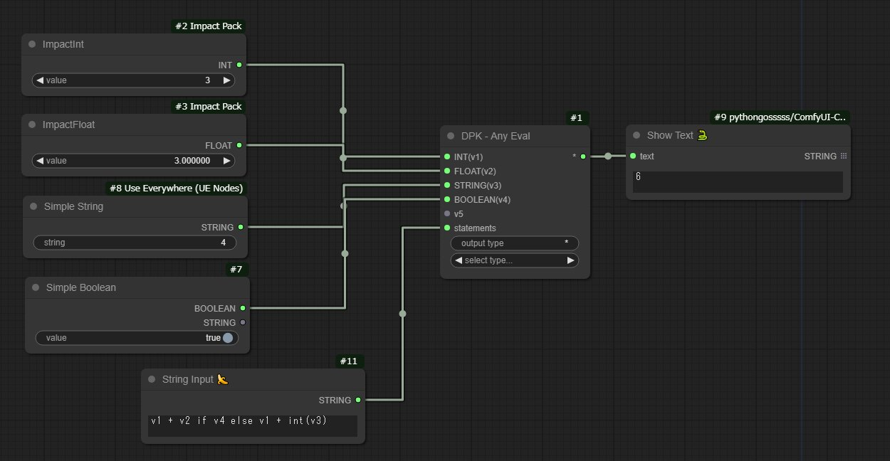
  
<h4>概要</h4>  
- 任意の型の入力を任意の数だけ受け入れ、それらを引数としてstatementsに従った処理を行い、結果を出力するノードです。 
- output typeで出力されるデータ型を具体的に明示しておかないと、フロントエンド(UI)の各種スクリプトが正しく動作しない場合があります。 

 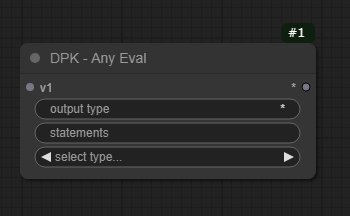 
★ 入力について 
・ 任意の型の入力が可能ですが、コード中で適切に処理するようにしてください。 
・ ノード接続時、やりとりされるデータ型は自動認識され、ラベルに反映されます。 
・ 最初の画像で型名の後に示されている「v1,v2,v3...」のような文字列は、statementsでの変数名となります。 
★ statementsウィジェットについて 
・ このウィジェットには、実行時に処理したい<b>python言語のコード</b>を入力します。 
・ <b>1行のコード</b>は<a href="https://docs.python.org/ja/3.6/library/functions.html#eval">eval</a>関数で処理されます。 
　関数の仕様に由来する制限に留意してください。<b><a href="https://docs.python.org/ja/3/reference/simple_stmts.html">文</a>ではなく<a href="https://docs.python.org/ja/3/reference/expressions.html">式</a>が必要です。</b> 
・ <b>複数行のコード</b>は動的インポートされたファイル内の関数として処理されます。 
　非同期処理以外はおそらく何でもできます。<b>return文が必要です。</b> 
・ 入力スロットに接続したノードから渡される<b>データは、「v1,v2,v3...」のような変数名で参照できます。</b> 
　ラベルから期待するデータ構造と実際のデータが異なる場合があることに注意してください(たとえば、IMAGEはRGB形式ではなくTensor形式のデータです)。 
・ <b>v_all変数ですべてのデータが格納された配列を参照できます。</b> 
・ <b>utils変数を通じて、modules/anyeval_utils.pyで定義したカスタムモジュールを参照できます。</b> 
★ output typeウィジェットについて 
・ ここに入力した内容は<b>一部の例外を除いて実際に処理されるデータには何の影響も与えません</b>。 
　フロントエンド（UI上）で動作するスクリプトに型を正しく認識させたり、意図的に誤認させたりするために使います。 
　例：<a href="https://github.com/chrisgoringe/cg-use-everywhere">Use Everywhere</a>が値の転送先を型名に基づいて正しく特定できるように、型名をワイルドカード「*」からLISTに変更する。 
　例：<a href="https://github.com/pythongosssss/ComfyUI-Custom-Scripts">Show Text</a>は、実際にはSTRING以外のデータを文字列として表示できるため、型名をINTではなくワイルドカード「*」にしておく。 
・ 例外は<b> INT / FLOAT / BOOLEAN / STRING 型</b>です。これらの型はウィジェットの入力内容に基づいて<b>実行時に相互変換されます。</b> 
★ select typeウィジェットについて 
・ 型名をマウス操作で指定することができます。 
・ ここに表示される型名の一覧は、config.pyで編集することができます。 

    
<h4>使用例①　複数の数値を一括計算する（基本）</h4>
 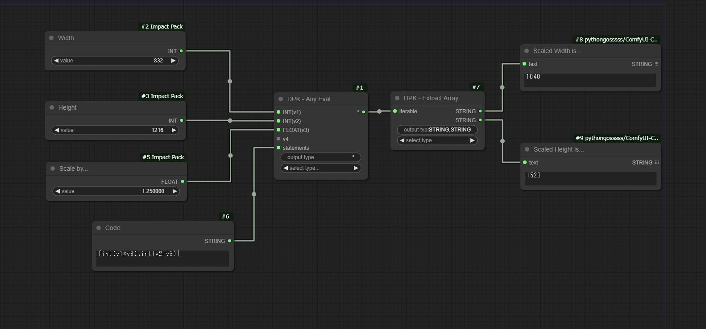   
- 変数1 * 変数3, 変数2 * 変数3の結果を配列として出力し、後述するカスタムノードで結果を展開し、表示しています。   
- アップスケール・Regional Prompt適用時の解像度計算に使えそうです。   
    
<h4>使用例②　ノードの配線を整理する（基本）</h4>
 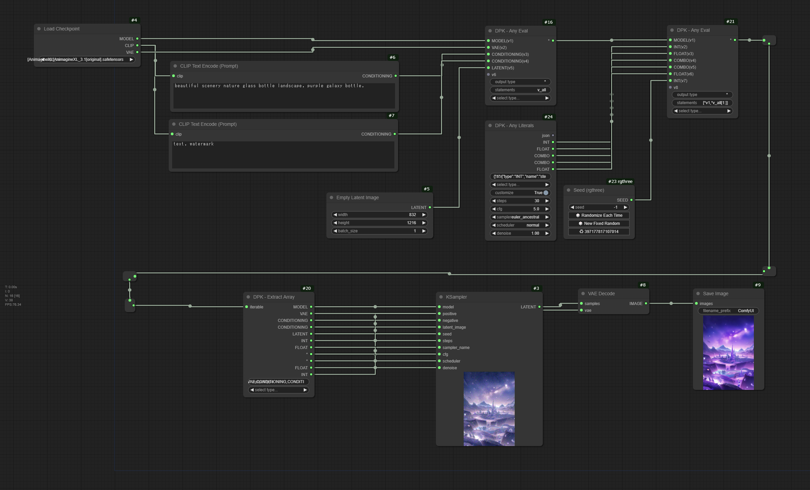 
- 任意の数の入力を受け取る性質を利用して、ノードの配線を単純化します。 
- statements欄にいちいちv1,v2,v3...と書いていくのはしんどいので、v_allで転送指定します。 
- 2番目のAnyEvalノードでは、「[*v1, *v_all[1:]]」というコードが書かれています。 
　これは、
「前のノードにおけるv1,v2...を集約する配列v1を元のv1,v2...自体に戻し(*v1)、 
　また一番目の要素=v1を除くすべての入力（v_all[1:]）をまとめた配列をv2,v3...にアンパックして(*v_all[1:])、 
　 これらすべての要素による配列を作成する([...])」 
  という意味のコードになります。 
  これにより、配列に配列が入ることを防ぎながら、無数の入力を途中追加していくことができるようになります。 
 
<h4>使用例③　外部プログラムと連携する（応用）</h4>
 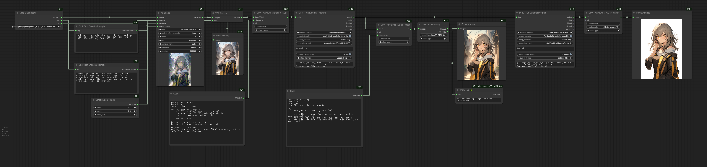 
- 後述する「DPK - Run External Program」と連携して、出力画像をGimpで開いて色温度を手動調整し、Photoshopのドロップレットで自動的に人物を切り抜いています。 
- GimpはRGB画像データを入力として受け付けますが、IMAGEという名前でやり取りされるデータの実態はTensorですので、これを変換する必要があります。 
　そこで、AnyEvalでTensorとRGBデータを相互変換しているのが今回の例になります。 
- 画像生成後・Gimp処理後の画像（中央右寄り）出力時・Photoshop処理後の画像（右）出力時で3回AnyEvalノードで相互変換を行っていますが、 
　1回目の処理では長ったらしくコードを書いていたのに対し、2回目以降の処理では「utils.to_tensor()」という謎の関数が現れており、3回目の処理では1行で画像の変換を終わらせていることに気づきます。 
 to_tensor()はmodules/anyeval_utils.pyで定義した関数で、utilsはそれを参照するための変数です。 
 同じモジュールを使いまわせるので便利に使ってください！ 
 

<h3 id="DPK_ExtractArray"> ②　DPK - Extract Array </h3>
<a href="#DPK_CallProgram">次のノードへ</a>
 
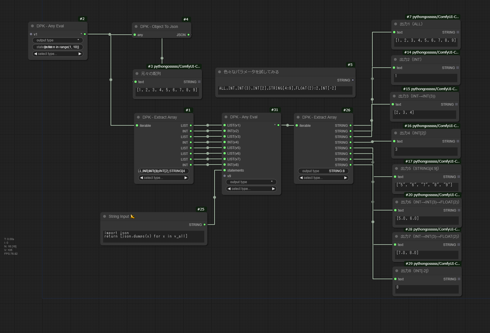
<h4>概要</h4>  
- 配列データを入力として受け入れ、output typeで指定したコマンドに基づいて要素を抽出・出力するノードです。 

 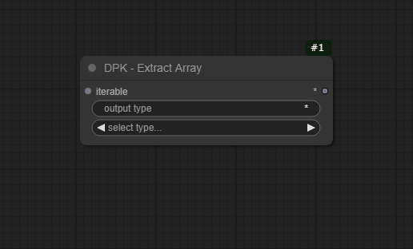 
★ 入力について 
  ・ LIST型（およびワイルドカード型）の入力を受け入れます。列挙可能なオブジェクト以外の入力は実行時にエラーが発生します。 
  ・ （１）AnyEvalノードとの接続時、（２）このノードが初期状態であり、（３）AnyEvalのstatementsが十分に単純（例：v_all / v1 / [v1,v4,v2]）であるとき、 
  　このノードのoutput typeと出力スロットを自動で設定します。 
  ★ output typeウィジェットについて 
  ・ コマンドは以下の表の通りに構成され、カンマ区切りで抽出方法の複数指定を行うことができます。 
  ・ 入力データと型指定が一致しない場合、STRING,INT,FLOAT,BOOLEAN型データについては相互変換が試みられます。 
  ・ 表における「index」とは、配列における要素の位置を示す数値のことです。 
  　実行開始時には0であり、特定のコマンド実行時に取り出した要素の分だけ加算されます。 
   
  <table>
  <tr>
    <th>フォーマット</th>
    <th>表現例</th>
    <th>解釈
</th>
    <th>実行前のデータ</th>
    <th>実行後のデータ</th>
  </tr>
  <tr>
    <td>TYPE</td>
    <td>INT</td>
    <td>現在のindexから要素を1個取り出し、INT型として出力する。indexを1進める。&nbsp;&nbsp;&nbsp;&nbsp;&nbsp;&nbsp;&nbsp;&nbsp;&nbsp;&nbsp;&nbsp;&nbsp;&nbsp;&nbsp;&nbsp;&nbsp;&nbsp;&nbsp;&nbsp;&nbsp;&nbsp;&nbsp;&nbsp;&nbsp;&nbsp;&nbsp;&nbsp;&nbsp;&nbsp;&nbsp;&nbsp;&nbsp;&nbsp;&nbsp;&nbsp;&nbsp;&nbsp;&nbsp;&nbsp;&nbsp;&nbsp;&nbsp;&nbsp;&nbsp;&nbsp;&nbsp;&nbsp;&nbsp;&nbsp;&nbsp;&nbsp;&nbsp;&nbsp;&nbsp;&nbsp;</td>
    <td>[1,2,3,4,5]</td>
    <td>1 （index=0の場合）</td>
  </tr>
  <tr>
    <td>TYPE(NUM) NUM>0</td>
    <td>FLOAT(3)</td>
    <td>現在のindexから要素を3個取り出し、要素がFLOAT型の配列として出力する。indexを3進める。</td>
    <td>[1.0,2.0,3.0,4.0,5.0]</td>
    <td>[1.0,2.0,3.0] （index=0の場合）</td>
  </tr>
  <tr>
    <td>TYPE[NUM] NUM>=0</td>
    <td>STRING[3]</td>
    <td>index=3の（すなわち4番目の）要素を取り出し、STRING型として出力する。</td>
    <td>["foo","bar","baz","nan","you"]</td>
    <td>"nan"</td>
  </tr>
  <tr>
    <td>TYPE[NUM] NUM<0</td>
    <td>BOOLEAN[-2]</td>
    <td>末尾を起点として2番目の要素を取り出し、BOOLEAN型として出力する。</td>
    <td>[True,False,True,False,True]</td>
    <td>False</td>
  </tr>
  <tr>
    <td>TYPE[NUM1:NUM2] NUM2>NUM1>=0</td>
    <td>*[2:5]</td>
    <td>index=2からindex=<b>4</b>(5-1)までの要素を取り出し、配列として出力する。</td>
    <td>[1,"2",{"hello": "world"},4.0,False]</td>
    <td>[{"hello":"world},4.0,False]</td>
  </tr>
  <tr>
    <td>TYPE[NUM1:NUM2] 0>NUM2>NUM1</td>
    <td>INT[-5:-2]</td>
    <td>末尾を起点として<b>3</b>(-2-1)番目から5番目までの要素を取り出し、要素がINT型の配列として出力する。</td>
    <td>[1,2,3,4,5]</td>
    <td>[1,2,3]</td>
  </tr>
  <tr>
    <td>ALL</td>
    <td>ALL</td>
    <td>すべての要素を配列として出力する。</td>
    <td>[null,[1,2,3],{"comfy":"ui"}]</td>
    <td>[null,[1,2,3],{"comfy":"ui"}]</td>
  </tr>
  <tr>
    <td>COMMAND:NUM NUM>0</td>
    <td>INT(2):2</td>
    <td>INT(2)の操作を2回実行する。indexを2x2=4進める。出力スロットは2個生成される。</td>
    <td>[1,2,3,4,5]</td>
    <td>[1,2], [3,4]  (index=0の場合)</td>
  </tr>
</table>
  ・分かりにくいですか？一応実際の例を置いておきます。
     入力（配列）：[1,2,3,4,5,6,7,8,9,10]のとき、
   - output_typeがINT,INT,INT(2),INT:4の場合、出力はスロットごとに1,2,[3,4],5,6,7,8になります。
     これらは前から順に取り出していく構文になります。
   - output_typeがINT[1],INT[4:6],INT[-2]:2,INTの場合、出力はスロットごとに2,[5,6],9,9,1になります。
   　位置を指定すると、その位置から取り出すだけになります。
     
　★ select typeウィジェットについて 
　・ 型名をマウス操作で指定することができます。 
　・ ここに表示される型名の一覧は、config.pyで編集することができます。（AnyTypeノードと共用） 

<h4>このノードを使用する状況</h4>
・AnyEvalから結果を必要な分だけ展開するために使います。 
 

<h4 id="DPK_CallProgram"> ③　DPK - Run External Program</h4>
<a href="#DPK_ToJson">次のノードへ</a>
 
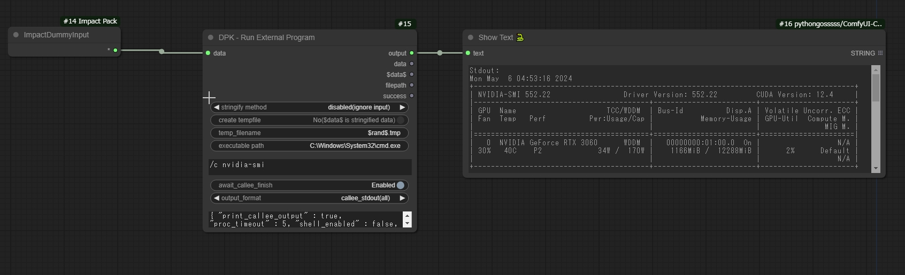
- <b>現在、このノードの動作は安定していません。</b> 
- 入力データを変換した文字列または、入力データが書き込まれた一時ファイルのパスを引数として外部プログラムを起動し、その結果を出力するノード。 

 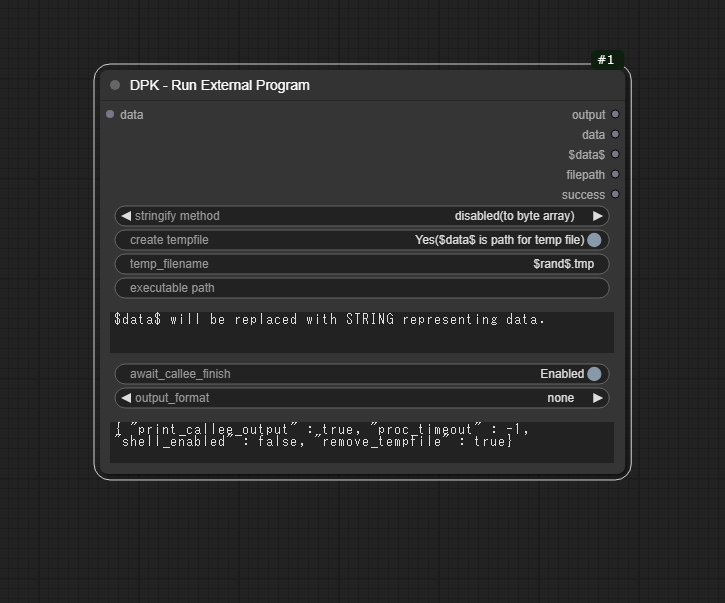 
★ 入力について 
・入力データは基本的に任意ですが、一時ファイルにバイトデータを書き込むオプションを有効にした場合は、 
  STRING,INT,FLOAT,BOOL,<a href="https://docs.python.org/3.10/library/stdtypes.html#bytearray">ByteArray</a>,<a href="https://docs.python.org/3.10/library/stdtypes.html#bytes">Bytes</a>型のデータ入力のみサポートしています。
 
★ ウィジェットについて 
・ <b>stringify method</b>: 入力データを文字列に変換する場合は、その方法を指定します。 
<table>
  <tr>
    <td>disabled(to byte array)</td>
    <td>文字列ではなく、バイトデータに変換します。そのデータを一時ファイルに書き込み、ファイルパスを引数として使用します。</td>
  </tr>
  <tr>
    <td>disabled(ignore input)</td>
    <td>入力データは使用しません。</td>
  </tr>
  <tr>
    <td>str()</td>
    <td>str関数を用いて変換します。1.0→"1.0"のように期待通り変換されることもあれば、変換がサポートされていないため単に型名に置き換えられることもあります。</td>
  </tr>
  <tr>
    <td><a href="https://docs.python.org/ja/3.10/library/json.html">json.dumps()</a></td>
    <td>言語間で共有可能なjson形式のテキストに変換します。変換可能なオブジェクトには一定の制限があります。</td>
  </tr>
  <tr>
    <td><a href="https://jsonpickle.github.io/">jsonpickle.encode()</a></td>
    <td>pythonスクリプト間で共有可能なjson形式のテキストに変換します。</td>
  </tr>
</table>
・<b>create tempfile</b>: 変換後のデータを用いて一時ファイルを作成するか、文字列をそのまま引数に使用します。 
・<b>temp filename</b>: 一時ファイルのファイル名を指定します。$rand$キーワードはランダムな文字列に置換されます。 
・<b>executable path</b>: 実行可能ファイルを指定します。cmd.exeを指定すると、nvidia-smiなどのコマンドを使用することができます（一部コマンドは動作しません）。 
・<b>（コマンド入力欄）</b>: 実行可能ファイルへのパスに続く引数を指定します。 
  　　　　　　　　　　$data$は、文字列に変換された入力データまたはデータが書き込まれた一時ファイルへのフルパスに置換されます。 
・<b>await callee finish</b>: 呼び出されたプログラムが終了するまで待機するかどうか。 
・<b>output format</b>: outputスロットから出力されるデータを選択します。 
<table>
  <tr>
    <td>none</td>
    <td>何も出力しません。await callee finishが無効の場合はこれ以外選択できません。</td>
  </tr>
  <tr>
    <td>updated_file</td>
    <td>外部プログラムによって更新された一時ファイルのバイトデータを出力します。</td>
  </tr>
  <tr>
    <td>callee_stdout(all)</td>
    <td>呼び出されたプログラムの標準出力（コンソールに現れる文字列）を出力します。</td>
  </tr>
  <tr>
    <td>callee_stdout(last line)</td>
    <td>標準出力の最終行を出力します。</td>
  </tr>
</table>
・<b>（追加パラメーター入力欄）</b> 
<table>
  <tr>
    <td>print_callee_output</td>
    <td>標準出力をComfyUI側のコンソールに表示します。(true/false)</td>
  </tr>
  <tr>
    <td>proc_timeout</td>
    <td>指定時間内にプログラムが終了しなかった場合、強制終了します。（-1を指定すると無効）</td>
  </tr>
  <tr>
    <td>shell_enabled</td>
    <td>Windowsの場合、シェルコマンドを実行する場合のみ有効化してください。(true/false）</td>
  </tr>
  <tr>
    <td>remove_tempfile</td>
    <td>このノードにおける処理完了時に一時ファイルを削除します。(true/false)</td>
  </tr>
</table>
★ 出力について 
・outputからはoutput formatで指定したデータが出力されます。 
・dataからは入力データがそのまま、$data$からはデータを表現する文字列またはファイルパスが出力されます。  
・filepathは一時ファイル作成オプションが有効の場合にその絶対パスが出力されます。 
・successはエラーが発生することなく処理が終了したかを示します。望ましい動作が行われたことを保証するものではありません。 

 
<h4>このノードを使用する状況</h4>
・AnyEvalノードの使用例③で示したように、GimpやPhotoshop等の外部プログラムと連携した処理を行いたいとき。 
・ワークフローの実行後に、何らかのデータをメモ帳などで表示したいとき。 
・ワークフロー実行中にあわせて何らかのバッチコマンドを実行したいとき（現在、動作が不安定）。 

<h4 id="DPK_AnyLiterals"> ④　DPK - Any Literals</h4>
<a href="#DPK_SetManyNodeState">次のノードへ</a>
 
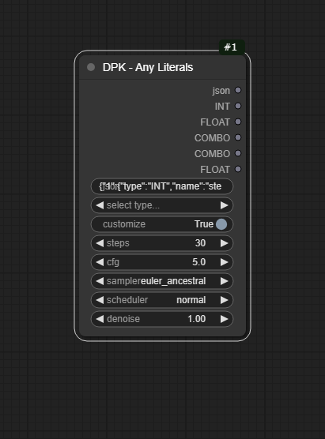
 
<h4>概要</h4>  
- INT型、FLOAT型、STRING型、BOOLEAN型、COMBO型のデータ入力が可能なウィジェットを動的に生成するノードです。 
- customizeを有効にすると、INT,FLOAT用のウィジェット生成時に最大値・最小値・増減単位・表示桁数を指定できます。 
- また、STRINGの入力欄として複数行のテキストボックスを生成できます（バグあり）。 

 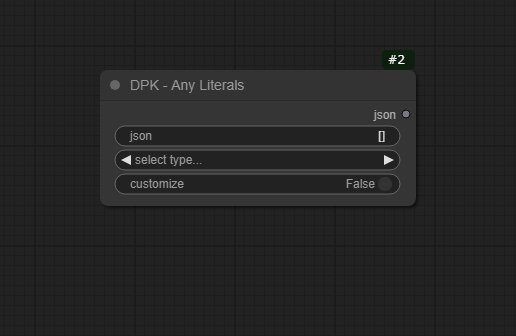 
★ 設定ウィジェットについて 
・select typeウィジェットでは、入力したいデータ型をマウス操作で選択することができます。 
・<b>customizeウィジェットが無効(Disabled)の場合、デフォルトの設定でウィジェットが生成されます。</b> 
　有効の場合、概要で述べた項目と、ウィジェットの名前（「select type」など）の入力を求めるダイアログが表示されます。 
　（とくに意味もなく「Enter Widget Name...」などと英文で問いかけますが気にしないでください。） 
★ jsonウィジェットについて 
・このウィジェットには、生成されたウィジェットの設定・現在値のデータがjson形式のテキストとして記録されます。 
　これを編集することにより、ウィジェットの一部を削除・編集・追加することができます。 
・データは以下のような構成になっています。（分かる人向け） 
　{"一意のID(INT)": {"type":"INT/FLOAT/STRING/BOOLEAN/COMBO", "name": "名前(STRING)", "value": 値("a",1,falseなど), "options": { （追加オプション） }}} 
・追加オプションの部分は、データ型によって次のようなパターンがあります。 

<table>
  <tr>
    <td>INT,FLOAT</td>
    <td>"min":最小値,"max":最大値,"step":増減単位,"precision":計算精度(INT型の場合0)</td>
  </tr>
  <tr>
    <td>STRING</td>
    <td>"multiline":true/false もしくは null</td>
  </tr>
  <tr>
    <td>BOOLEAN</td>
    <td>"on": トグルがオンの時の表示名（"Enabled"など）, "off": オフ時の表示名（"Disabled"など)</td>
  </tr>
  <tr>
    <td>COMBO</td>
    <td>"values": 選択肢となるSTRINGを要素に取る配列（例：["foo","bar"]）</td>
  </tr>
</table>
・jsonウィジェットに正しい形式の文字列を貼り付けると、そのデータに基づいてウィジェットが一度に生成されます。 
　（<b>空欄にするとすべてのウィジェットを消去できます。</b>） 
★入力値の自動調整機能について 
・標準のウィジェットでは、step（増減単位）を設定しても、手動入力（ポップアップしたテキストボックスにデータを入力した）時に値がそのまま入力される問題があります。 
・このノードで生成されるウィジェットでは、<b>入力完了時に最大値・最小値・増減単位に基づいて最も近い合法値を計算し、指定の計算精度で結果を表示します。</b> 
　例：min=512, max=4096, step=64, precision=3の設定で、入力値が1132だと出力値は1152になりました。 
★出力について 
・jsonスロットからは、jsonウィジェットの内容が出力されます。 
・それ以降のスロットからは、ウィジェットの並び順に対応した値が指定の型で出力されます。 
　<b>ただし、COMBOウィジェットの値については、他のCOMBO型・STRING型入力スロットに接続できるように見かけ上ワイルドカード型として出力されます。</b> 
★DPK - Set Node Statesとの連携については、下に続く説明を参照してください。 

<h4>このノードを使用する状況</h4>
・設定関係の数値入力を一つのノードで完結させたいとき 
・入力できる数値・文字列に独自の制限を設けたいとき（SDXLの解像度で64の倍数を入力するときなど） 
 

<h4 id="DPK_SetManyNodeState"> ⑤　DPK - Set Node States</h4>
<a href="#DPK_RealtimeTextPreview">次のノードへ</a>
 
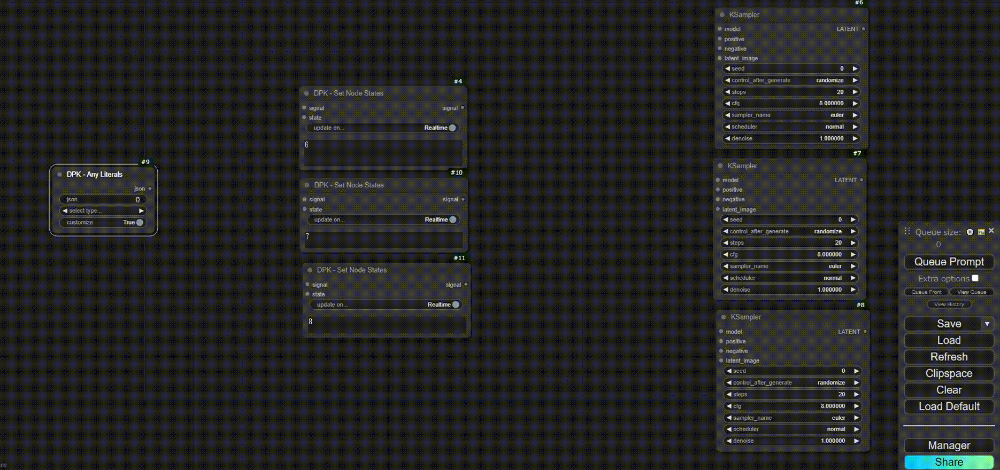
 
<h4>概要</h4>  
- 一度に一つまたは複数のノードIDを指定して、リアルタイムまたはワークフローの実行直前にノード状態を変更します。 
- AnyLiteralsノードと連携して、一つのノードで複数のフローの有効/無効を切り替えることができるようになります。（バグがなければ） 
- 画像のワークフローには<a href="assets/DPK_SetManyNodeState/header-workflow.png">この画像</a>からアクセスできます。 

 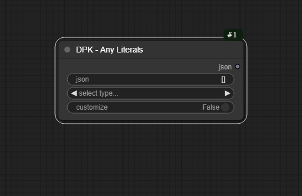 
★入出力について 
・signalスロットは、実行時にノード状態を切り替える場合のダミー入力として使用します。 
　この場合、出力のsignalスロットへと値がそのまま転送されます。 
　他のノードと接続されていることで実現できる何かがある場合に使ってください。 
★ウィジェットについて 
・update on...では、設定したノード状態の反映タイミングを、Realtime（入力直後）またはExecution（実行直前）から選択することができます。 
　<b>いずれにおいても、このノード自体がBypass,Mute状態の場合は一切何もしません。</b>
・stateでは、ノード状態をActive,Bypass,Muteのいずれかから選択できます。 
　Bypass時に値をそのまま転送し、Mute時に処理を終了してほしいのに代わりにエラーを発生させるのはComfyUIの仕様であり、このノードが原因ではありません。 
・node idでは、1,4,9のようにノードIDをカンマ区切りで繋げて、ノード状態を適用する対象を選択します。 
　<b>ノードIDを可視化するには、ComfyUI Managerをインストールし、右下のManager→左中央のBadge:から「#ID NickName」を選択してください。</b> 
　入力が完了してノードの選択状態（白枠になっている状態）を解除すると、無効なノードIDを自動的に取り除きます。 
　取り除かれたIDについては、F12キーで表示されるコンソールのメッセージを確認してください。 
★AnyLiteralsとの連携機能について 
・ヘッダー画像で示したように、以下の手順でstateウィジェットの値をAnyLiteralsノードのウィジェットと連動させることができます。 
　1. stateウィジェットをスロットに変換する（右クリック→Convert Widget to Input→Convert state to Input） 
　2. Any Literalsノードのselect typeでCOMBOを選択し、選択肢として「Active」「Bypass」「Mute」のうち二つ以上をカンマ区切りで入力、ウィジェットの生成を完了する。 
　3. 同時に追加された出力スロットを、SetManyNodeStateの適切な入力スロットに接続する。 
・面倒ですが、状態を管理したいセクションが複数ある場合は、上の手順を繰り返してください。 

<h4>このノードを使用する状況</h4>
・ComfyUIの流儀に反して一画面にすべてを収めたいとき 
・特定ノードの状態を切り替えるときに画面を右往左往したくないとき 
 

<h4 id="DPK_RealtimeTextPreview"> ⑥　DPK - Realtime Text Preview</h4>
<a href="#DPK_DynamicAction">次のノードへ</a>
 
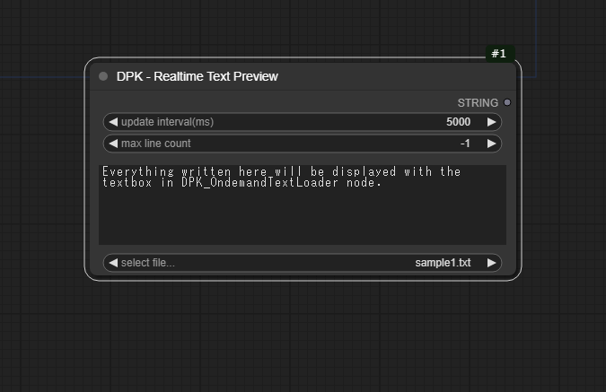
 
<h4>概要</h4>  
- "ComfyUI/web/extensions/dpk/text-preview"フォルダに配置されたテキストファイルを選択し、一定の間隔で更新プレビューします。 
- 残念なことにシンボリックリンクは機能しないようです。 

★ウィジェットについて 
・update interval(ms)では、ファイルの更新を反映する最小間隔をミリ秒単位で指定します。外部プログラムと連携するのでなければ大きな数値にしてください。 
・max line countでは、テキストを最終行から何行分表示するかを指定します。-1の場合は全文表示します。 
・preview欄にはテキストが表示されます。 
　<b>エンコーディングがUTF-8以外のテキストは文字化けする可能性があります。</b> 
・select file...では、text-previewフォルダのfilelist.txtで列挙されたファイル名から読み込みたいものを選択します。 
　filelist.txtの内容は、ComfyUIの起動時に自動的に更新されます。 
　サブディレクトリのファイルも表示します。 
★出力について 
・preview欄に書いてある内容がそのまま出力されます。 

<h4>このノードを使用する状況</h4>
・プロンプトやDynamic Promptのテンプレートを表示したいとき（プレビュー機能のみ使用） 
・ウィンドウを切り替えずにComfyUIのログを確認したいとき 
<detail>
　ComfyUIフォルダ直下に以下の内容のbatファイルを置いて実行したところ、一応日本語表示までできました。 
　venv環境を使わない方は一行目を削除すると良いでしょう。 
　call venv\Scripts\activate 
　chcp 65001 
　python main.py （色々な引数） > web/extensions/dpk/text-preview/output.txt 2>&1 
　pause 
</detail>
 

<h4 id="DPK_DynamicAction"> ⑦ DPK - Dynamic Action</h4>
<a href="#DPK_ToJson">次のノードへ</a>
 
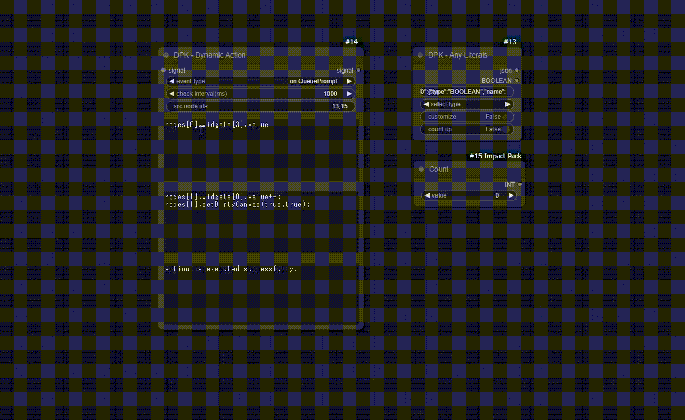
 
<h4>概要</h4>  
- アクション、アクションを実行する条件、実行タイミング、参照するノードのID(s)を指定して、任意のアクションを実行します。 
- 画像のワークフローには<a href="assets/DPK_DynamicAction/header-workflow.png">この画像</a>からアクセスできます。 

 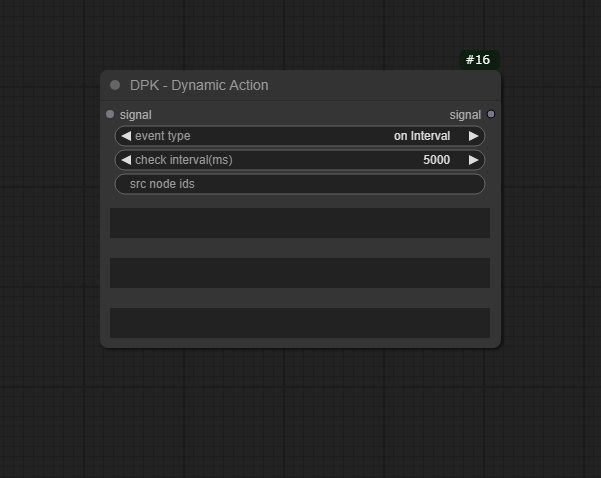 
 ★入出力について 
・signalスロットは、ノードの処理が実行されるタイミングでアクションを実行する場合のダミー入力として使用します。 
　この場合、出力のsignalスロットへと値がそのまま転送されます。 
 ★ウィジェットについて 
 ・event typeでは、アクションの実行タイミングを指定します。 
 <table>
  <tr>
   <td>on Interval</td>
   <td>check interval(ms)にてミリ秒単位で指定した時間ごとにアクションを実行します。</td>
  </tr>
  <tr>
   <td>on QueuePrompt</td>
   <td>QueuePromptボタンまたはCtrl+Enterでワークフローを実行する時にアクションを実行します。</td>
  </tr>
  <tr>
   <td>on Execute</td>
   <td>フローの中でノードの処理が実際に行われる時にアクションを実行します。</td>
  </tr>
  <tr>
   <td>on Startup Only</td>
   <td>ワークフローの読み込み時に一回だけアクションを実行します。</td>
  </tr>
 </table>
・src node idsでは、条件部やアクションのコード内で参照する各ノードのIDを指定します。 
　<b>ノードIDを可視化するには、ComfyUI Managerをインストールし、右下のManager→左中央のBadge:から「#ID NickName」を選択してください。</b> 
・その下の2個のテキストボックスは、順にアクションの実行条件、アクションを<b>Javascript言語で</b>入力するものです。 
 　実行条件のコードは真偽値を返すように記載してください。 
 　src node idsで指定したIDに合致するノードオブジェクト（ComfyNode）は、nodes変数（配列）に順に格納されています。 
・ComfyNodeオブジェクトからは、inputsプロパティで各入力スロット、outputsで各出力スロット、widgetsで各ウィジェットの配列を取得することができます。 
 　詳細については、壊れてもよいワークフローで色々試したり、色々なカスタムノードのソースコード（.jsファイル）を参照してみてください。 
 　このカスタムノードのソースコードを読んでも構いませんが、仕様も言語もコード管理も分からないまま格闘した結果悲惨なコードになっていますので、その点だけ了承お願いします。 
・一番下のテキストボックスは、アクションの実行ステータスを表示するものです。 
 　条件部や実行部でエラーが発生している場合は、その旨が記載されます。 
 　F12キーで開くコンソールで詳細なエラーメッセージを確認することもできます。 

 
<h4>このノードを使用する状況</h4>
・複数ウィジェットの値を同期させたいとき。 
・何かをするたびに何かを変化させて、それをトリガーに何かをする……といった機構を実現したいとき。 
 

<h4 id="DPK_ToJson"> ⑧　DPK - Object To Json</h4>
<h4 id="DPK_FromJson"> ⑨　DPK - Json To Object</h4>
 
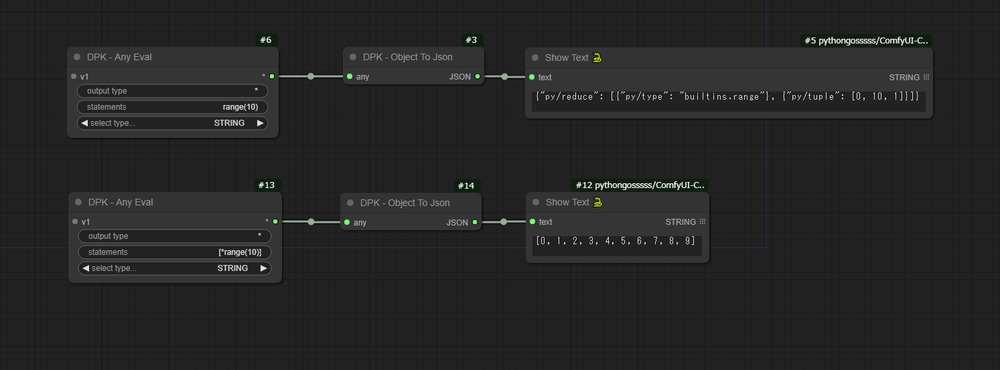
 
<h4>概要</h4>  
- Object To Jsonノードは、設定に応じて、jsonpickle.encode()またはjson.dumps()を使用してオブジェクトを文字列へと変換します。 
- Json To Objectノードは、jsonpickle.decode()またはjson.loads()を使用して文字列をオブジェクトへと変換します。 
 

### 注意事項
- 一部のカスタムノード（AnyEvalやFromJsonなど）は、セキュリティリスクを発生させることが知られている機能を利用しています。  
 自分以外の人物が作成したワークフローを使用するさいは、**config.pyを編集して関連ノードの機能を制限しておく**ことを推奨します。
- 技術的な制約や技術力の関係で、現時点では解決できない既知の問題が存在します。  
  予期しない視覚的なグリッチやデータ損失を防ぐために、太字の部分だけでも読んでおくことを推奨します。
  - 全般  
    - フロントエンド（UI）で何らかのリアルタイム処理を行うノード(*)は、**グループ化すると、正常に機能しなくなるおそれがあります**。  
      \* 例：AnyEvalノードは、入力スロットの接続状態が変わるたびに内部データを更新する
      
  
      　グループノードの入出力スロットやウィジェットの状態は元のノード群とまったくリンクしていません。入力値や接続状態はバインド（同期）されませんし、（ノード接続時や値入力時等の）イベント処理も元のノード群に伝播しません。グループノードのこうした性質は、ノード個別の状態管理を完全に破壊します。  
      
  
    - **リアルタイム処理の対象となるウィジェット(*)の値を他のノードにより間接的に入力する場合は、値を変更するたびにノードを再接続する**必要があります。  
      \* 例：AnyEvalノードでは、output typeの変更時に出力値の型情報が自動変更される
      

      ウィジェットを入力スロットに変換し、Simple Stringノードなどからこれに接続しても、ウィジェットの入力値はバインド（同期）されません。そして、他のノードで発生した入力イベントを捕捉する処理は実装コストが高すぎます。したがって、カスタムノード本体にアクションを起こすことでイベントを手動で発生させる代替案を採用しています。
      
  
    - カスタムノードの**直接的な接続元・接続先に、特殊な状態のグループノード(*)を配置すると、一部のノード連携機能が正常に動作しなくなる可能性があります。**  
      \*  例：ボタン等の特殊なウィジェットを含むノードが組み込まれたグループノード    
      \*  例：Manage Group Nodeから一部スロットを非表示にしたグループノード
      

      グループノード内から（見かけ上ではない）実際の接続先となる子ノードを取得するさい、グループノードの入出力スロット・ウィジェットの一部がVisibleではなかったり、子ノードのいずれかに特殊なウィジェット（例：Seedボタン）が含まれていたりすると、子ノードや子ノードに対応するスロットの特定に失敗することがあります。  
      これにより、AnyEvalノードにおける型名の自動表示機能等が期待通り動作しなくなる可能性があります。
      

    - 本家ReRouteノードは（当環境では）イベントの誤作動を引き起こすケースがあるため、カスタムノードの一部の入力側と接続できないように設定しています。  
    **[rgthree](https://github.com/rgthree/rgthree-comfy)や[ComfyUI-Custom-Scripts](https://github.com/pythongosssss/ComfyUI-Custom-Scripts)に付属しているノードの使用を検討してください。**  
  <!-- -- (詳細) Aを通常のノード、Bを任意の型を入力として受け取るノード、RをRerouteノードとします。  
    1. A-Rが接続されているとして、R-Bが新たに接続された場合、Bにおいて接続状態の変更イベントが発生し、接続が確立されたことを示す情報が渡されることが期待されます。しかし、問題のノードと接続すると、接続が切断されたことを示す情報が渡されます。(Rが適切にイベントを処理していない？)
    2. R-Bが接続されているとして、A-Rが新たに接続された場合、接続状態の変更イベントはAとRの間でのみ発生すべきです。しかし、問題のノードはこのとき、Bに対して接続の切断イベントを発生させます。（Rが「任意の型」を認識できていない） -->
  - DPK - Any Eval
    - 直接的な接続元のノードがBypass状態であるとき、このノードはエラーを発生させず、代わりに入力値を一つ減らして処理を実行します(*)。  
      \* 例：見かけ上v1,v2,v3の入力スロットにノードが接続されていても、v2スロットの接続元ノードがBypass状態であると、実行時にはv1,v2(v3からスライド)のみが変数リストに追加される
      

      おま環でなければComfyUI本体の仕様であり、現時点で修正案はありません。SetManyNodeStateによるワークフロー実行前のモード操作によりこの仕様を悪用し、ワークフローの実行時にノードの状態に応じてその値が確定するような変数を仕込むなんてこともできるかもしれません。
      
 
  - DPK - Set Node States
    - QueuePromptボタンを押す、もしくはCtrl+Enterを押す以外の操作でワークフローを実行すると、mode指定の変更が高確率でその回の試行に反映されなくなります(*)。  
      \* 例：見かけ上は実行前にノードをBypass状態にできたが、依然として固有の処理が実行されている。
  - DPK - Run External Program
    - "nvcc -V"等一部のコマンドは機能せず、タイムアウトを設定しない場合は処理が完了しません。
    - 一部のアプリケーションでは、ウィンドウ（GUI）が表示されないことがあります。
  - DPK - Any Literals
    - 複数行入力のテキストボックスを追加すると、ノードのサイズが適切に調整されず、出力スロットがウィジェットと重なります。  
      ページを再読み込みすることでこの現象は一時的に解決します。

## 免責事項
本プロジェクトは個人的な目的で開発した成果物（カスタムノード）を単に共有するものです。
- 不具合への対処・機能改善・各種メンテナンスに関する責任は負いません。  
- 成果物の使用による不利益・損害に対する責任は負いません。

## クレジット
制作にあたり、インターネット上の様々な資料を参照させていただきました。
そのなかで、本プロジェクトのソースコードに直接的な影響を及ぼしたものをご紹介します（順不同）。

comfyanonymous/[ComfyUI](https://github.com/comfyanonymous/ComfyUI) (GPL-3.0 license) - ノードの基本設計や基本機能を学ばせていただきました。

pythongosssss/[ComfyUI-Custom-Scripts](https://github.com/pythongosssss/ComfyUI-Custom-Scripts) (MIT license) - ウィジェットの動的生成方法を学ばせていただきました。

chrisgoringe/[cg-use-everywhere](https://github.com/chrisgoringe/cg-use-everywhere) (Apache-2.0 license) - フロントエンドにおけるノード間連携の方法を学ばせていただきました。

ltdrdata/[ComfyUI-Impact-Pack](https://github.com/ltdrdata/ComfyUI-Impact-Pack) (GPL-3.0 license) - ノード制作のアイディアやノード操作の方法など、幅広い面の学習でお世話になりました。
